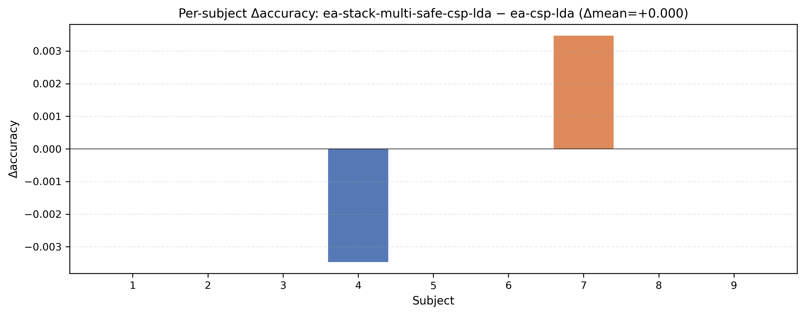
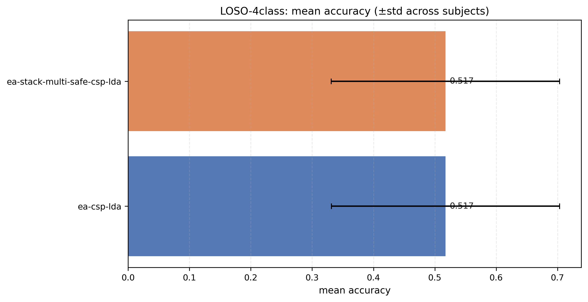

# 20260111 — BNCI2014\_001 4-class LOSO — CAR（Common Average Reference）单杠杆实验（结论：不建议开启）

## 0) 背景与假设（Failure-first）
**现状**：在 BNCI2014\_001 4-class strict LOSO（`paper_fir` + CSP6 + LDA）上，我们的当前主方法 `ea-stack-multi-safe-csp-lda` 能稳定达到 **+1.77pp 且 0 负迁移**（见 20260108 强 baselines 主表 run）。

**本轮假设**：参考“Revisiting EA”一类经验，先做一个最小、无标签、可复现的预处理改动：**CAR**（通道均值参考），可能降低公共噪声/参考漂移，从而提升 EA/stack 的稳定性与绝对精度。

**本轮只动一个杠杆**：`preprocess += CAR`（其余协议/模型/selector/gates 全部保持不变）。

---

## 1) 协议（严格可比）
- Dataset：BNCI2014\_001（BCI-IV 2a）
- Task：4-class（left\_hand / right\_hand / feet / tongue）
- Split：严格 LOSO（cross-subject）
- Preprocess：`paper_fir`（8–30Hz, causal FIR, 0.5–3.5s, 250Hz）
- Model：CSP(n=6) + LDA
- Metrics：macro（脚本默认）

---

## 2) 方法改动（实现）
新增可选开关 `--car`（默认关闭），并在数据加载后执行：

\[
X \leftarrow X - \frac{1}{C}\sum_{c=1}^{C} X_c
\]

实现方式：**对每个 trial、每个时间点**，减去该时间点的通道均值波形（per-trial CAR）。

- 代码提交：`c477cf8a31bba45f55be8284264aba5a00d39723`
- 入口：`run_csp_lda_loso.py` / `run_csp_lda_cross_session.py`

---

## 3) 复现实验（命令与产物）
### 3.1 EA baseline（CAR on）
- 输出目录：`outputs/20260111/4class/loso4_bnci2014_001_car_ea_only_v1/`
- 复现命令：见 `outputs/20260111/4class/loso4_bnci2014_001_car_ea_only_v1/20260111_results.txt`

### 3.2 Ours（CAR on）
- 输出目录：`outputs/20260111/4class/loso4_bnci2014_001_car_stack_v1/`
- 复现命令：见 `outputs/20260111/4class/loso4_bnci2014_001_car_stack_v1/20260111_results.txt`

### 3.3 合并对比（同一 run 口径的主表/统计）
为了得到 `Δacc_vs_EA` / `neg_transfer` 等同口径指标，将两次 run 合并：
- 合并输出目录：`outputs/20260111/4class/loso4_bnci2014_001_car_merged_v1/`
- 主表（含 paired test）：`outputs/20260111/4class/loso4_bnci2014_001_car_merged_v1/20260111_main_table.md`

---

## 4) 结果（结论：CAR 对本任务有害）
### 4.1 CAR 条件下（本轮）
从 `outputs/20260111/4class/loso4_bnci2014_001_car_merged_v1/20260111_main_table.md`：
- `ea-csp-lda`：mean acc **0.5174**，worst **0.2361**
- `ea-stack-multi-safe-csp-lda`：mean acc **0.5174**（Δ=**+0.00pp**），neg\_transfer **0.1111**（1/9），accept\_rate **0.3333**

### 4.2 与非 CAR 主表（对照）
对照 20260108 强 baselines（非 CAR）：
- `ea-csp-lda`：**0.5320**
- `ea-stack-multi-safe-csp-lda`：**0.5498**（+1.77pp，0 负迁移）

因此：
- CAR 使 EA baseline 下降约 **−1.47pp**
- CAR 使主方法下降约 **−3.24pp**（并引入 1/9 的负迁移）

---

## 5) 证据图（可直接用于汇报）
图目录：`docs/experiments/figures/20260111_loso4_bnci2014_001_car_v1/`

重点图：
- Per-subject Δacc（Ours − EA）：  
  
- Mean accuracy 对比：  
  

---

## 6) 失败原因初判（为什么 CAR 会伤）
当前证据只足以给出“现象 + 合理解释”，后续若要写进论文，可补充对 CSP pattern/协方差结构的对比图：
- CAR 会把每个时间点的全局均值成分强制去掉，可能**削弱了 MI 相关的空间对比结构**（尤其当“共同参考/体积传导成分”里也混有判别信息时）。
- 在本仓库的主干里，EA（whitening）本身也在做一种“全局线性重整化”；CAR 叠加在 EA 之前可能导致 **有效判别子空间被压扁**，最终表现为 EA 和候选族整体 headroom 下降、accept\_rate 下降。

---

## 7) 决策与下一步
**决策**：保留 `--car` 作为可选开关（便于跨数据集/跨 setting 探索），但 **主线不启用 CAR**（该 setting 下明确掉点）。

**下一步（回到主线）**：继续在 **非 CAR** 条件下优化 “证书有效性 + safe selector” 或扩展候选族（但仍遵守 one-lever-per-iteration）。

