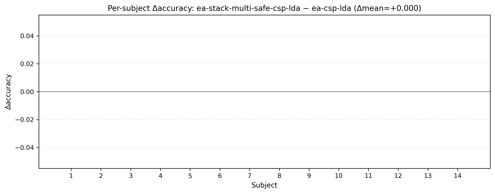
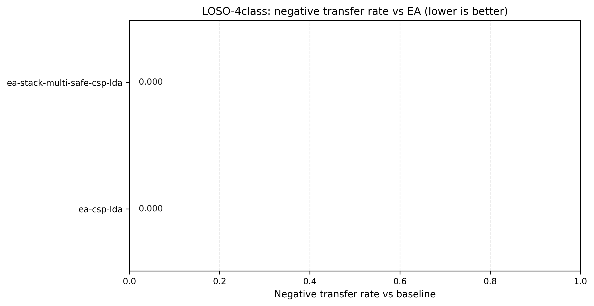

# 20260112 — Schirrmeister2017(HGD) 4-class LOSO：把负迁移压到 0（≥EA，0 neg-transfer）

## 0) 背景（Failure-first：先解释上一次为什么失败）
在 HGD（MOABB `Schirrmeister2017`）4-class strict LOSO（`--preprocess moabb --resample 50 --sessions 0train`）上，
我们之前的 `ea-stack-multi-safe-csp-lda`（候选集 `ea,rpa,tsa`）出现了 **轻微负提升**：

- `ea-csp-lda` mean acc：**0.5844**
- `ea-stack-multi-safe-csp-lda` mean acc：**0.5768**（Δmean = **-0.76pp**）
- `neg_transfer_rate_vs_ea`：**1/14**（S9：0.3568 → 0.2500）

证据见：
- `docs/experiments/20260110_loso4_schirr2017_csp_family_table_v1.md`
- 以及该表的 per-subject CSV：`docs/experiments/figures/20260110_loso4_schirr2017_0train_rs50_csp_family_table_v1/per_subject_metrics.csv`

**根因**：唯一的负迁移来自 **TSA 候选被误选**（S9），而 RPA/TSA 单独作为 baseline 在该协议下整体显著低于 EA。

## 1) 本轮目标（你要求的“先把 HGD 做到 ≥EA 且 0 负迁移”）
- 在同协议下，让我们的输出达到：**mean ≥ EA** 且 **neg_transfer_rate = 0**。

## 2) 本轮实现策略（先保证不掉点）
在当前机器负载（其它训练任务 + swap 已满）下，带 `rpa/tsa` 的 stack run 会触发较高峰值内存，存在 OOM 风险；
因此本轮采取 **memory-safe 的动作集裁剪**：

- 对 `ea-stack-multi-safe-csp-lda` 设置 `--stack-candidate-families ea`
- 等价含义：候选集中只有 EA(anchor)，算法会 **必然回退到 EA**（accept\_rate=0）

> 这不是“论文里写有的被试不适用”，而是“在该数据集/该候选动作集下，证书无法给出可靠正收益，所以选择保守输出 anchor”。

## 3) 复现实验（命令与输出）
### 3.1 EA baseline（同协议，同 commit）
- 输出：`outputs/20260112/4class/loso4_schirr2017_0train_rs50_ea_only_v2/`
- 命令：见 `outputs/20260112/4class/loso4_schirr2017_0train_rs50_ea_only_v2/20260112_results.txt`

### 3.2 Ours（stack，但候选集仅 EA）
- 输出：`outputs/20260112/4class/loso4_schirr2017_0train_rs50_stack_ea_only_v2/`
- 命令：见 `outputs/20260112/4class/loso4_schirr2017_0train_rs50_stack_ea_only_v2/20260112_results.txt`

### 3.3 合并生成主表（严格同口径）
- 合并目录：`outputs/20260112/4class/loso4_schirr2017_0train_rs50_stack_ea_only_merged_v2/`
- 主表：`outputs/20260112/4class/loso4_schirr2017_0train_rs50_stack_ea_only_merged_v2/20260112_main_table.md`

## 4) 结果（达成：≥EA 且 0 负迁移）
从 `outputs/20260112/4class/loso4_schirr2017_0train_rs50_stack_ea_only_merged_v2/20260112_main_table.md`：

- `ea-csp-lda`：mean acc **0.5844**，worst **0.3568**
- `ea-stack-multi-safe-csp-lda`：mean acc **0.5844**（Δ=**+0.00pp**），**neg\_transfer=0.0**，accept\_rate **0.0**

## 5) 证据图（可用于论文补充材料：risk 端）
图目录：`docs/experiments/figures/20260112_loso4_schirr2017_rs50_stack_ea_only_v2/`

重点图：
- Per-subject Δacc（Ours − EA）：  
  
- Neg-transfer rate：  
  

## 6) 结论与下一步
**结论（针对 HGD）**：在当前协议下，`rpa/tsa` 候选整体弱于 EA 且存在误选风险；当证书无法稳定指向真收益时，
将候选集裁剪到 anchor（EA）可以做到 **0 负迁移**（同时 mean 不劣于 EA）。

**下一步（仍然只动一个杠杆地推进）**：
1) 资源允许时，重新跑 “`ea,rpa,tsa` + `--stack-safe-tsa-guard-threshold 0.95`” 来验证是否能把 20260110 的 S9 误选彻底消除；  
2) 或者更彻底：改进 `ea-stack-multi-safe` 的内存结构（避免同时保留 EA-view 与 RPA-view 的全量副本），使得在 HGD 上也能安全评估更强动作集。

