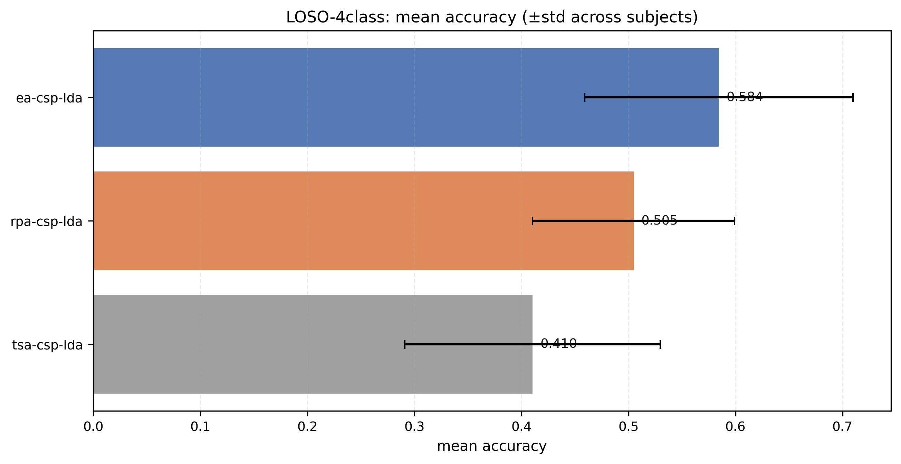
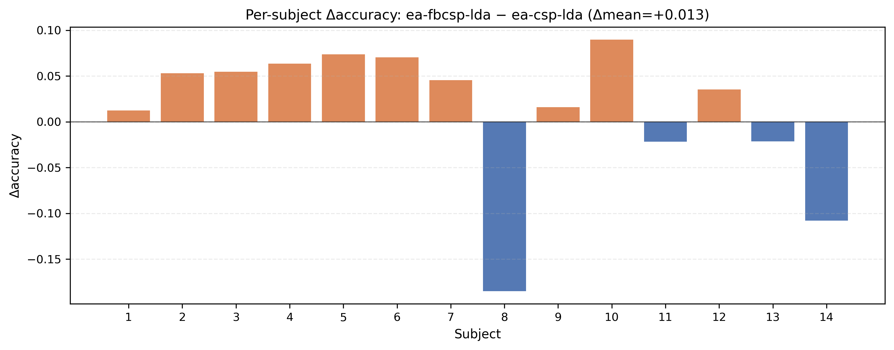

# 20260114 — Schirrmeister2017(HGD) 4-class LOSO：扩展下层动作集（baseline sweep，找 headroom）

## 0) 背景（Failure-first：为什么需要做动作集 sweep）
在 HGD（MOABB `Schirrmeister2017`）4-class strict LOSO（`--preprocess moabb --resample 50 --sessions 0train`）上：

- `ea-csp-lda` 是强 anchor（mean acc **0.5844**）
- `rpa-csp-lda` / `tsa-csp-lda` 在该协议下整体显著低于 EA（见 `docs/experiments/20260110_loso4_schirr2017_csp_family_table_v1.md`）
- 因此 `ea-stack-multi-safe-csp-lda` 在候选集仅含 `rpa/tsa` 时，要么 **accept_rate≈0**（基本回退 EA），要么少量误选导致负迁移

结论：当前瓶颈更像是 **动作集本身缺少稳定 headroom**，而不是单纯“证书/guard 调参”。

## 1) 本轮目标（只动一个杠杆：扩展动作集）
在完全相同协议下，跑一组可比 baseline，回答两个问题：

1) HGD 上是否存在 **稳定 ≥ EA** 的候选 family（给 safe selector 提供可选空间）？
2) 如果存在，哪些方法最值得加入 `ea-stack-multi-safe-*` 的动作集（同时兼顾风险/收益）？

## 2) 协议（必须严格一致）
- Dataset：`Schirrmeister2017`
- Task：4-class（`left_hand,right_hand,feet,rest`）
- Split：LOSO（跨被试）
- Sessions：`0train`
- Preprocess：`moabb`
- Band：8–30 Hz（moabb 默认）
- Epoch：0.5–3.5s（moabb 默认）
- Resample：50 Hz（为降低内存峰值）
- CSP components：`--n-components 4`（与 EA anchor 保持一致）
- Metrics：macro（脚本默认）

Anchor 参考输出：
- `outputs/20260112/4class/loso4_schirr2017_0train_rs50_ea_only_v2/20260112_results.txt`

## 3) 本轮要扫的 baseline（动作集候选）
为避免 HGD 内存峰值，**每次只跑一个 method**，然后用 `scripts/merge_loso_runs.py` 合并成主表。

计划方法（按优先级）：
- `ea-csp-lda`（anchor，已存在；用于合并对照）
- `fbcsp-lda`
- `ea-fbcsp-lda`
- `riemann-mdm`
- `ts-lr`
- `rpa-mdm`
- `rpa-rot-mdm`
- `ts-svc`
- `tsa-ts-svc`
- `rpa-ts-lr`
- `ea-ts-lr`
- `rpa-csp-lda`
- `tsa-csp-lda`

## 4) 复现实验（命令与输出）
本轮用脚本串行跑（便于复现/避免并发内存峰值）：
- `scripts/run_hgd_baseline_sweep_20260114.sh`
- 总控 log：`outputs/20260114/4class/hgd_baseline_sweep_20260114.nohup.log`

### 4.1 运行模板
```bash
conda run -n eeg python run_csp_lda_loso.py \
  --dataset Schirrmeister2017 \
  --events left_hand,right_hand,feet,rest \
  --sessions 0train \
  --preprocess moabb --resample 50 \
  --n-components 4 \
  --methods <METHOD> \
  --run-name <RUN_NAME> \
  --no-plots
```

### 4.2 已完成 runs（同协议）
#### 4.2.1 EA anchor
- 输出：`outputs/20260114/4class/loso4_schirr2017_0train_rs50_ea_only_v3/`
- 命令：见 `outputs/20260114/4class/loso4_schirr2017_0train_rs50_ea_only_v3/20260114_results.txt`
- 结果：mean acc **0.5844**，worst **0.3568**

#### 4.2.2 RPA / TSA（CSP-family）
- RPA 输出：`outputs/20260114/4class/loso4_schirr2017_0train_rs50_rpa_csp_lda_v1/`
  - 命令：见 `outputs/20260114/4class/loso4_schirr2017_0train_rs50_rpa_csp_lda_v1/20260114_results.txt`
  - 结果：mean acc **0.5049**，worst **0.3239**
- TSA 输出：`outputs/20260114/4class/loso4_schirr2017_0train_rs50_tsa_csp_lda_v1/`
  - 命令：见 `outputs/20260114/4class/loso4_schirr2017_0train_rs50_tsa_csp_lda_v1/20260114_results.txt`
  - 结果：mean acc **0.4104**，worst **0.2318**

#### 4.2.3 FBCSP-family
> 注意：本轮 sweep 跨越了 0 点，部分 run 的输出目录落在 `outputs/20260115/`（但日志仍写在 `outputs/20260114/`）。

- `fbcsp-lda` 输出：`outputs/20260114/4class/loso4_schirr2017_0train_rs50_fbcsp_lda_v1/`
  - 命令：见 `outputs/20260114/4class/loso4_schirr2017_0train_rs50_fbcsp_lda_v1/20260114_results.txt`
  - 结果：mean acc **0.4506**，worst **0.2598**（显著低于 EA）
- `ea-fbcsp-lda` 输出：`outputs/20260115/4class/loso4_schirr2017_0train_rs50_ea_fbcsp_lda_v1/`
  - 命令：见 `outputs/20260115/4class/loso4_schirr2017_0train_rs50_ea_fbcsp_lda_v1/20260115_results.txt`
  - 结果：mean acc **0.5971**，worst **0.3727**（mean 比 EA +**1.27pp**，但存在负迁移 4/14）

### 4.3 合并与主表（严格同口径）
合并脚本：`scripts/merge_loso_runs.py`（要求各 run trial 索引一致）

合并目录：
- `outputs/20260114/4class/loso4_schirr2017_0train_rs50_csp_family_table_v3_merged/`

主表：
- `outputs/20260114/4class/loso4_schirr2017_0train_rs50_csp_family_table_v3_merged/20260114_main_table.md`

图表：
- `docs/experiments/figures/20260114_loso4_schirr2017_rs50_csp_family_table_v3/`

### 4.4 部分合并：含 EA / RPA / TSA / FBCSP / EA-FBCSP（阶段性主表）
合并目录：
- `outputs/20260115/4class/loso4_schirr2017_0train_rs50_baseline_sweep_partial_v1_merged/`

主表：
- `outputs/20260115/4class/loso4_schirr2017_0train_rs50_baseline_sweep_partial_v1_merged/20260115_main_table.md`

图表：
- `docs/experiments/figures/20260115_loso4_schirr2017_rs50_baseline_sweep_partial_v1/`

### 4.5 仍在运行的 runs（同协议）
脚本后续还会继续跑（耗时更长）：
- `riemann-mdm`, `fgmdm`, `ts-svc`

对应 per-run log（实时进度看这些）：
- `outputs/20260114/4class/loso4_schirr2017_0train_rs50_riemann_mdm_v1.nohup.log`
- `outputs/20260114/4class/loso4_schirr2017_0train_rs50_fgmdm_v1.nohup.log`
- `outputs/20260114/4class/loso4_schirr2017_0train_rs50_ts_svc_v1.nohup.log`

## 5) 结果与诊断（待填）
需要在最终主表中固定报告（用于论文叙事）：
- mean accuracy（以及 kappa 若已输出）
- worst-subject accuracy
- neg_transfer_rate（相对 EA）
- 如果后续用于证书：oracle gap（best-by-oracle vs best-by-cert）

## 6) 下一步（取决于 sweep 结果）
- 若存在明显强于 EA 的 baseline：将其加入 `ea-stack-multi-safe-*` 动作集，并做 family-specific gate（先压 neg-transfer，再追 mean）
- 若所有 baseline 都显著低于 EA：说明 HGD 在该协议下“EA 已接近上限”，需要换更强表征/模型 family（或改变任务定义/预处理，但需明确不可比边界）

## 7) 阶段性结论（已完成的 CSP-family）
在当前协议下（HGD 4-class, 0train, rs=50），CSP-family 的 RPA/TSA 都显著低于 EA：

- `ea-csp-lda`：**0.5844**
- `rpa-csp-lda`：**0.5049**（Δmean = **-7.95pp**）
- `tsa-csp-lda`：**0.4104**（Δmean = **-17.40pp**）

因此，如果要在 HGD 上取得正收益，优先看 **FBCSP / Riemann / TS** 这些更强 family 是否能提供 headroom。

补充：在当前协议与实现下，**EA-FBCSP** 已经出现正收益（mean +1.27pp，worst 也上升），但存在 **4/14 的负迁移**，
因此更适合被纳入动作集作为“高风险候选”，由后续的 calibrated guard / drift gate 控制风险，而不是直接替换 EA。

## 8) 证据图（阶段性）
图目录：`docs/experiments/figures/20260114_loso4_schirr2017_rs50_csp_family_table_v3/`

重点图：
- Mean accuracy（主表对比）：  
  
- Per-subject Δacc（RPA − EA）：  
  

补充图（阶段性：EA-FBCSP vs EA）：
- Per-subject Δacc（EA-FBCSP − EA）：  
  
